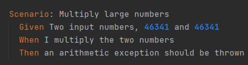
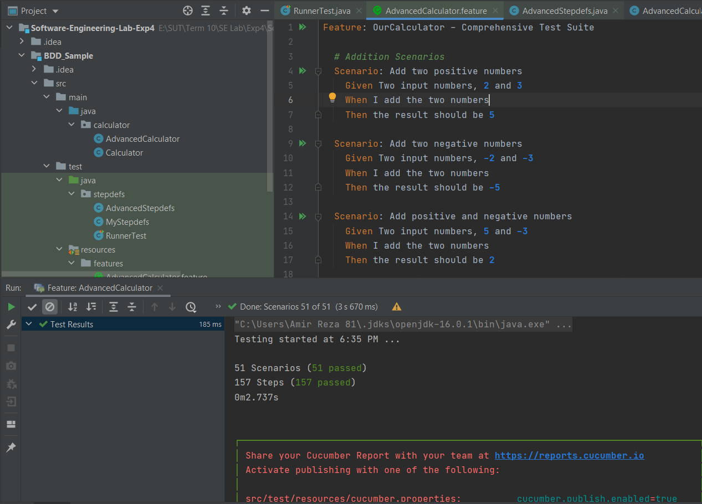

# Software-Engineering-Lab-Exp4

## بخش اول - نمونه اجرا BDD
فایل pom.xml را همانطور که گفته شده تغییر میدهیم.

حال maven را به شکل زیر تست میکنیم و نتیجه را میبینیم.

همچنین از قسمت External libraries مشاهده می کنیم که کتابخانه ها نصب شدند. همچنین گزینه import changes و enable auto import را هم انتخاب می کنیم.

حال پکیج resources را در پوشه تست به شکل گفته شده می سازیم و تنظیم می کنیم.

سپس پکیج calculator و دایرکتوری features را به شکل زیر می سازیم.

حال calculator.feature را میسازیم و کد داده شده را درونش قرار می دهیم.

حال mystepdefs را میسازیم و کد را درونش کپی میکنیم.

و سپس کلاس Calculator را به شکل زیر میسازیم.

حال با تست کردن Maven با مشکل رو‌به‌رو می شویم:

نسخه Maven را بالاتر می بریم و در این حالت Maven test بدون مشکل اجرا می شود:

با اجرای calculator.features ابتدا به مشکل برخوردیم و نیاز به تغییر نام فولدر java.test.calculator و همچنین استفاده از io برای استفاده از cucumber بود، با انجام این تغییرات تست به درستی اجرا شد:

سپس فایل RunnerTest.java را می سیازیم و کد داده شده را در آن پیاده می کنیم:

با اجرای این کد به ارور زیر می رسیم:

سپس با اضافه کردن مسیر فایل features به درستی اجرا می شود

سناریو outline را اضافه می کنیم:

با اجرای RunnerTest به مشکل زیر می رسیم:

علت بروز این تست عدد منفی 1- است که چون ما در فایل Mystepdefs فقط اعداد مثبت را ساپورت می کنیم به مشکل بر می خوریم.

## بخش دوم - رفع اشکال کد

 در Mystepdefs حالت `d+` را به به `int` تغییر می دهیم:

با این تغییر تست بدون مشکل پاس می شود:

---
## بخش دوم - ماشین حساب پیشرفته

در این بخش باید یک ماشین حساب هوشمند را پیاده‌سازی می‌کردیم. 
مشابه بخش گذشته، پیاده‌سازی‌ها را انجام دادیم. ابتدا در فایل 
`AdvancedCalculator.feature`
سناریوهای عادی را اضافه نمودیم.
در این سناریوها سعی نمودیم تمامی حالات جمع، تفریق، ضرب و تقسیم و توان را تست بنماییم.

بخشی از سناریوهای تست عادی:

سپس سناریو تست‌ها به صورت outline را نیز اضافه نمودیم.

همچنین همانطور که گفته شد، تست‌های خاص نیز در بین این 55 تست موجود نوشته شده است.

سپس این سناریوها را به موارد تست تبدیل نمودیم. 
در فایل `AdvancedStepdefs` این کار را انجام دادیم:

سپس فایل `.feature` را اجرا می‌کنیم و مشاهده می‌کنیم که تست‌ها پاس خواهند شد.

بعد از اجرای فایل 
`RunnerTest` نیز مشاهده می‌شود که تمامی تست‌ها پاس می‌شوند.

---

### توضیح نهایی

در این آزمایش ما با مفهوم BDD آشنا شدیم. 
ابندا یک نمونه پروژه عملی آماده را انجام داده و مطابق با دستور آزمایش پیش بردیم. سپس ایراد آن پروژه را برطرف کردیم.
در بخش نهایی آزمایش نیز، تلاش کردیم با توجه به مفاهیم آموخته، ماشین حسابی پیشرفته را با توجه به BDD و سناریوهای تست پیاده کنیم.

---

### تقسیم کار
در این آزمایش مانند باقی آزمایش‌ها سعی نمودیم تسک‌ها کاملا مساوی و عادلانه تقسیم بشوند به طوری که سهم هر کس تا جای ممکن در کدزنی و گزارش ‌نویسی یکی باشد.
دو نفر از اعضا به طور کامل تسک اول و دوم را که همپوشانی زیادی با هم داشت را انجام دادند. نفر سوم نیز تسک آخر که از تسک‌های دیگر مستقل بود را جلو برد.
همچنین در نهایت نیز تمامی سناریوها تست مجدد شدند و با پاس شدن تمامی آن‌ها، این آزمایش نیز به پایان رسید.

[لینک کانبان‌برد](https://github.com/users/omid-d/projects/3/views/1)

---

### اعضای تیم
- امیررضا آذری - 99101087
- رضا حیدری - 400109616
- امید دلیران - 400104931

